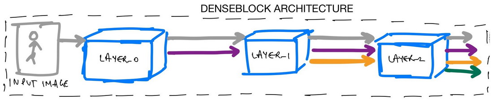

# DenseNet(Densely Connected Convolutional Networks)

We use and explain DenseNet-121 architecture in this repository

## DenseNet

In a DenseNet architecture, each layer is connected to every other layer, hence the name Densely  
Connected Convolutional Network. For L layers, there are L(L+1)/2 direct connections. For each layer, 
the feature maps of all the preceding layers are used as inputs, and its own feature maps are used as  
input for each subsequent layers.

This is really it, as simple as this may sound, DenseNets essentially conect every layer to every other 
layer. This is the main idea that is extremely powerful. The input of a layer inside DenseNet is the  
concatenation of feature maps from previous layers.

## Dense Blocks

Now that we understand that a DenseNet architecture is divided into multiple dense blocks, let’s look 
at a single dense block in a little more detail. Essentially, we know, that inside a dense block, each 
layer is connected to every other layer and the feature map size remains the same.

Let’s try and understand what’s really going on inside a dense block. We have some gray input features  
that are then passed to LAYER_0. The LAYER_0 performs a non-linear transformation to add purple features 
to the gray features. These are then used as input to LAYER_1 which performs a non-linear transformation 
to also add orange features to the gray and purple ones. And so on until the final output for this 3 layer 
denseblock is a concatenation of gray, purple, orange and green features.

So, in a dense block, each layer adds some features on top of the existing feature maps.

Therefore, as you can see the size of the feature map grows after a pass through each dense layer and the 
new features are concatenated to the existing features. One can think of the features as a global state of 
the network and each layer adds K features on top to the global state.

This parameter K is referred to as growth rate of the network.

## Types of DenseNet

We already know by now from following figure, that DenseNets are divided into multiple DenseBlocks. 
The various architectures of DenseNets have been summarized in the paper:

# Datasets

- In this project we use [ImageNet2012](https://www.image-net.org/download.php).

- And we use [oxford_iiit_pet](https://www.tensorflow.org/datasets/catalog/oxford_iiit_pet) dataset from tensorflow: 
  The Oxford-IIIT pet dataset is a 37 category pet image dataset with roughly 200 images for each class.  
  The images have large variations in scale, pose and lighting. All images have an associated ground truth annotation of breed.

# Installation

1. Install python

- requirement version 3.x **x = {7,8,9, 10}**

2. Create virtual environment

- pip install virtualenv
- python -m venv {name of virtual environment}
- activate it 
- 1. On Windows: C:/path to your env/Scripts/activate
- 2. On Linux: path to your env/bin/activate

3. `pip install -r requirements.txt`

# Features

### Deep Learning

- architectures are built using [tensorflow](https://github.com/tensorflow/tensorflow.git)
- run in colab 
